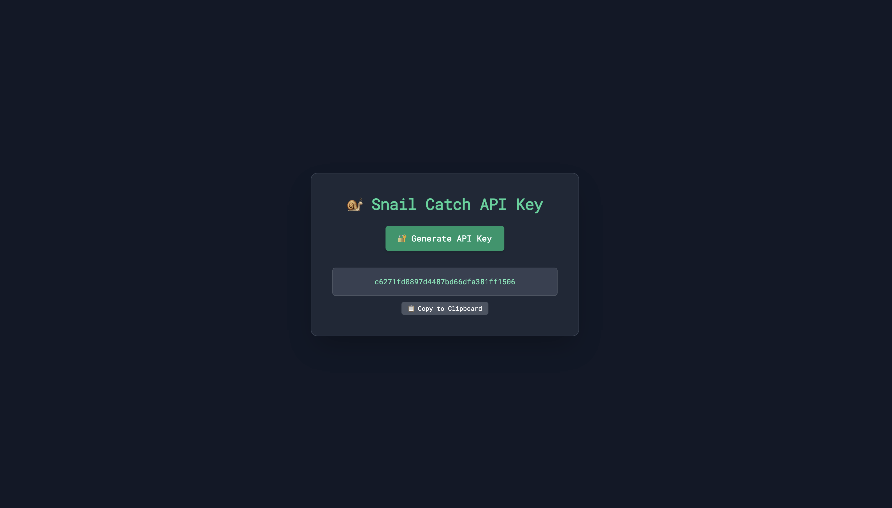
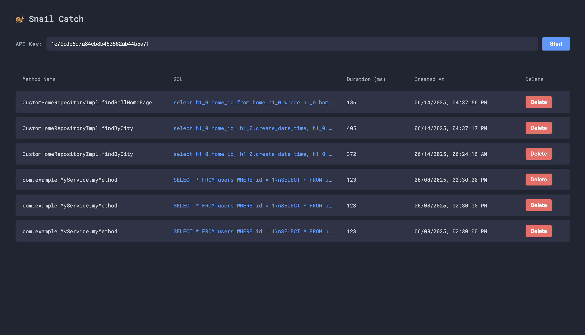
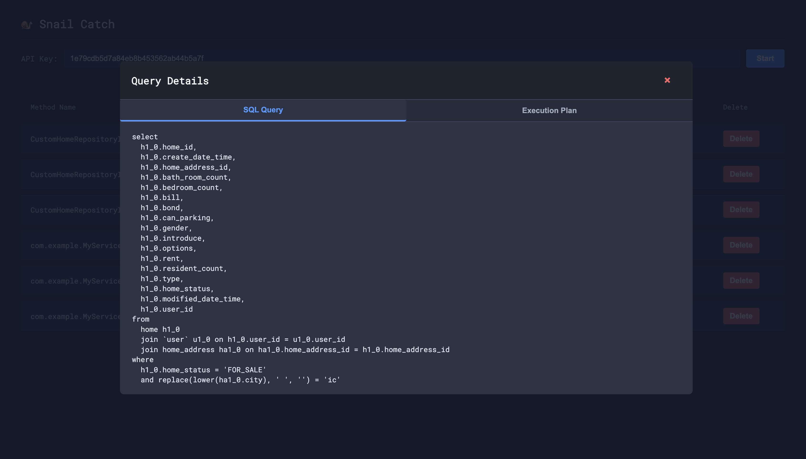

# 🐌 Snail Catch SDK Service


SnailCatch SQL Formatter SDK is a Java-based SQL log formatter that transforms complex and hard-to-read 
SQL statements and execution plans (EXPLAIN results) into a human-readable format.


## Who is this SDK useful for?

----

- Developers who frequently debug queries or want to organize and review SQL logs

- Developers who want to log and analyze EXPLAIN results to improve service performance

- Teams building or integrating internal SQL analysis tools or APM systems

## Features provided

--- 
Displays the bound SQL queries and execution plans in the console.

Provides a web page to view the collected query logs.

## Console Output Example

----

```text
==================== Snail Catch ====================
Method         : UserRepository.findByEmail
Execution Time : 13 ms
SQL Queries:
SELECT
  id, email, name
FROM
  users
WHERE
  email = 'test@example.com'

Execution Plans:
| id | select_type | table | partitions | type | possible_keys | key | key_len | ref | rows | filtered | Extra           |
|----|-------------|-------|------------|------|----------------|-----|---------|-----|------|----------|------------------|
| 1  | SIMPLE      | users | -          | ref  | email_index    | email_index | 767 | const | 1    | 100.0    | Using where     |
=====================================================

```

## How to Use

----

Currently, only queries using MySQL are supported for detection. 
We will update the version in the future to support other databases as well.

**1. Get a REST API Key**  

  Visit http://15.165.96.198/settings/api-key to generate your REST API key.



**2. Add the SnailCatch SDK to your build.gradle file**  

```
repositories {
    mavenCentral()
    maven { url 'https://jitpack.io' }
}

dependencies {
    implementation 'com.github.sinminseok:snail-catch:1.0.0'
}
```

You must use version 1.0.0 or higher of `com.github.sinminseok:snail-catch.`

**3. Configure application.yml**  

```
snail-catch:
  enabled: true
  repository-pointcut: {JPA pointcut expression}  # e.g., execution(* com.myapp.repository..*(..))
  api-key: {your issued key}
```

`enabled` : Enables or disables SnailCatch (default is true)

`repository-pointcut` : Pointcut expression to target repository classes for SQL detection

`api-key` : The REST API key issued in step 1


**4. Monitor Collected Query Logs**


You can monitor the collected query logs at: http://15.165.96.198/query-logs.  
Enter your issued API key to view the query logs.  
Click on any query to see detailed information and its execution plan.  





## Supported Environments & Minimum Requirements

----

| Item                                                                   | Requirement                                                 |
| ---------------------------------------------------------------------- | ----------------------------------------------------------- |
| **Java Version**                                                       | **Java 17 or higher required**                              |
| → Configured via `JavaLanguageVersion.of(17)`                          |                                                             |
| **Spring Boot Version**                                                | **3.2.5 or higher recommended**                             |
| → Using BOM: `org.springframework.boot:spring-boot-dependencies:3.2.5` |                                                             |
| **Gradle Plugins**                                                     | `shadowJar (8.1.1)`, `spring-dependency-management (1.1.7)` |
| → Ensure compatibility with your environment                           |                                                             |

##  Dependencies

----

| Library                                                          | Description                                                   |
| ---------------------------------------------------------------- | ------------------------------------------------------------- |
| `p6spy:p6spy:3.9.1`                                              | Core dependency for JDBC query logging                        |
| `com.github.vertical-blank:sql-formatter:2.0.3`                  | SQL formatting utility (pretty print)                         |
| `org.springframework.boot:spring-boot-starter-aop`               | Enables AOP-based SQL trace                                   |
| `org.springframework.boot:spring-boot-starter-data-jpa`          | JPA repository support                                        |
| `org.springframework.boot:spring-boot-starter-jdbc`              | JDBC query tracing with P6Spy                                 |
| `org.springframework:spring-aop`, `spring-context`, `spring-web` | Core Spring framework libraries                               |
| `lombok:1.18.30`                                                 | Lombok is required at **compile time** (annotation processor) |

## Important Notes for SDK Consumers

---


❗ Java 17 or higher is required.
→ Compilation will fail if you're using Java 11 or below.

❗ Spring Boot 3.2.5 is the baseline
→ If your project uses a lower Spring Boot version, especially below 3.x, dependency conflicts may occur (notably with spring-aop, spring-context, etc.).

⚠️ Be careful with P6Spy
→ If you're already using p6spy in your project, avoid duplicate configurations.
→ P6Spy settings should be configured only once per application.

⚠️ ShadowJar (fat JAR) packaging
→ The SDK is distributed as a fat JAR.
→ There is a risk of conflicts with external libraries if your project includes the same dependencies.

⚠️ Lombok must be enabled
→ Make sure annotationProcessor is properly set up.
→ Without it, you will get compilation errors.